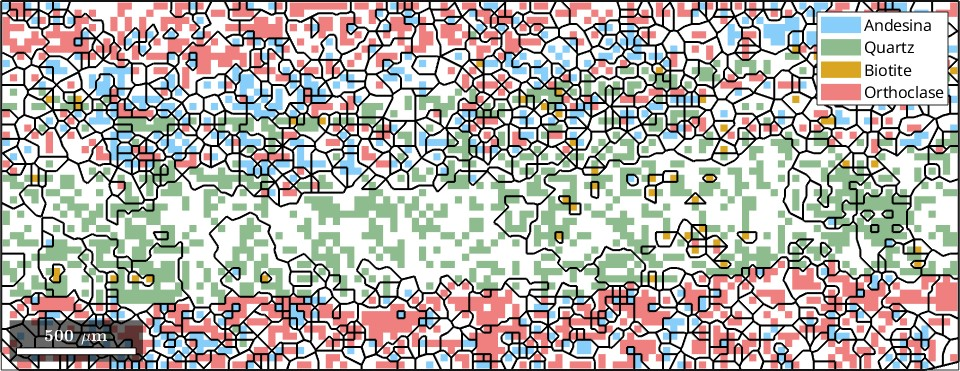
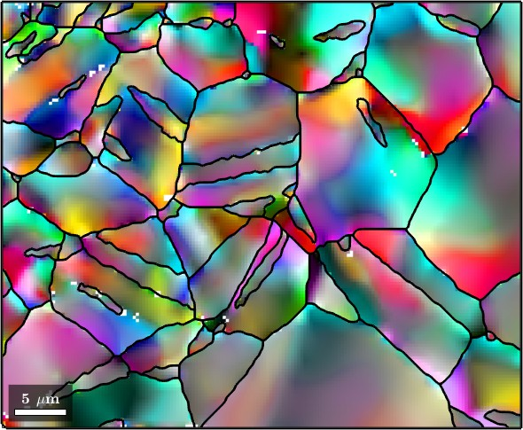
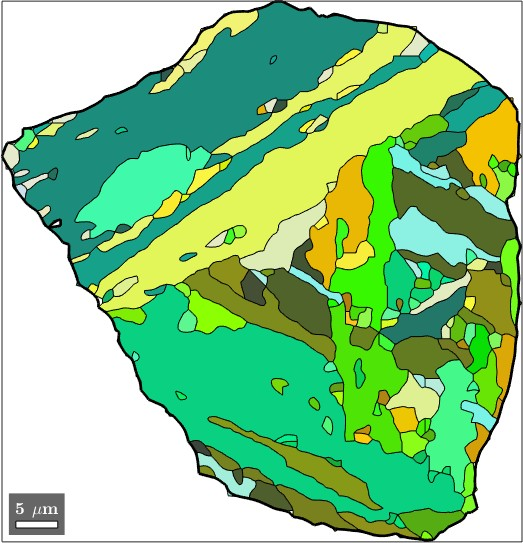
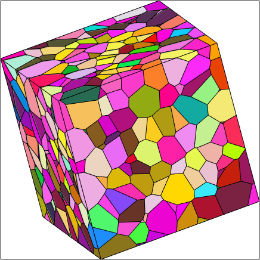
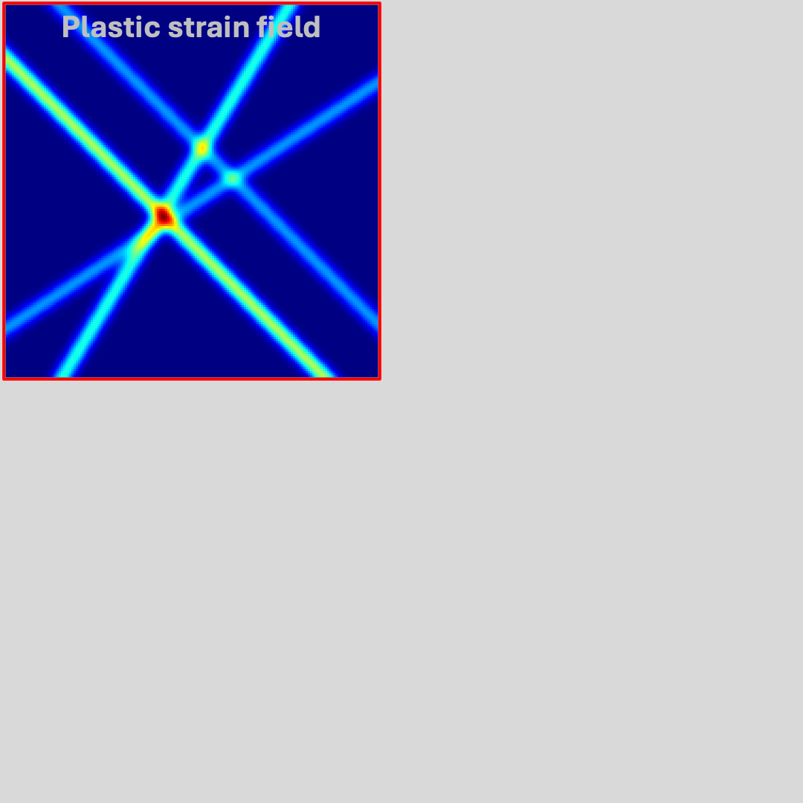
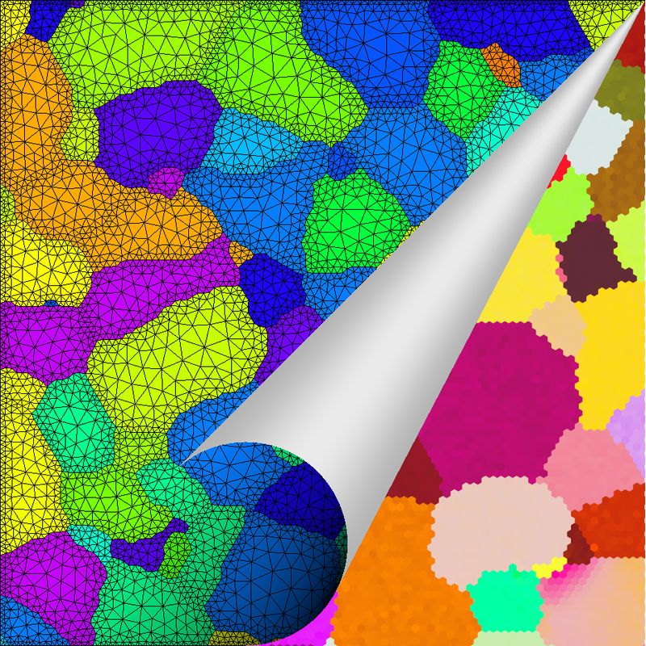
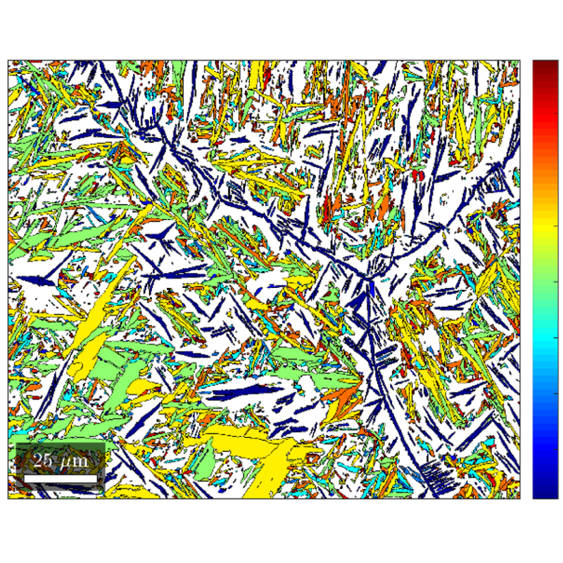

<b>MTEX</b> is a free and open source Matlab toolbox for analyzing and modeling
crystallographic textures by means of EBSD or pole figure data. It is developed
by an interdisciplinary 
of material scientists, geologists and mathematicians.
 
<!---->
<!--  -->
&nbsp;
<!--&nbsp;
&nbsp;-->
<!--&nbsp;-->
&nbsp;
&nbsp;

<!-- news and community card -->

    

        

            

				<i class="fa-solid fa-rss"></i>
                <!--<i class="fa fa-newspaper-o"></i>-->
                News
                <i class="fa fa-angle-double-right"></i>
                
            

            

                <ul class="no_bullet">
				<li>
                        03/25 &minus;
							
                        released:
                        
                    </li>
					<li>
						03/25 &minus;
						:
						
                    </li>
   					<li>
                        11/24 &minus;
							
                        released:
                        
                    </li>
					<!--<li>
						03/24 &minus;
						:
                        
                    </li>-->
                    <li>
                        03/22 &minus; addon 
                        
                        for parent grain reconstruction
                    </li>
                    <li>
                        03/22 &minus;
                        
                        by 
                        
                    </li>
                    <li>
                        07/21 &minus;
                        
                        by J. Hiscocks
                    </li>
                 </ul>
            

        

    

    

        

            

                <i class="fas fa-users"></i>
                Community
            

            

                <ul class="no_bullet">
                    <li>
                         - Questions, Discussions,
						Announcements
                    </li>
                    <li>
						 - Every bug report is welcome
                    </li>
					<li>
                        
						<!--<i class="fa fa-toolbox"></i>-->
                    </li>
                    <li>
					   {% include reference.html link="https://gist.github.com/search?q=%23mtexScript&s=updated&o=desc"
						content='<i class="fa fa-screwdriver-wrench"></i> Helper functions' %}
                        - 
                    </li>
                    <li>
                        
                        - it's easy to add documentation or new features
                    </li>
					<li>
						
                        - lectures and exercises on the usage of MTEX
                    </li>
					<!--
                    <li>
                        
                            GitHub Repository
                            <i class="fa fa-github"></i>
                        
                        
                        and
                        
                            ResearchGate Project
                            
                        
                        
                    </li>
                    <li>
                         explaining MTEX
                    </li>-->
                </ul>
            

        

    

<!-- a bunch of links as documentation overview  -->

    

        

            

                <i class="fa fa-book"></i>
                Documentation
                <i class="fa fa-angle-double-right"></i>
                
                | 
                | 
                | 
                | 
            

        

    

<!-- some featured examples with image and description -->

    

        

            

					
            

            

                <h4></h4>
                
A quick guide through the grain reconstruction capabilities.

                <!---->
            

        

    

    

        

            

				
            

            

                <h4></h4>
                
A quick comparison of different denoising methods for EBSD data.

                <!---->
            

        

    

    

        

            

				
            

            

                <h4></h4>
                
A workflow for the reconstruction of parent austenite grains.

                <!---->
            

        

    

	

        

            

				
            

            

                <h4></h4>
                
A quick guide how to import and analyze 3d grain data.

                <!---->
            

        

    

<!-- a bunch of links as documentation overview  -->

    

        

            

                <i class="fa fa-screwdriver-wrench"></i>
                Add-ons
                <i class="fa fa-angle-double-right"></i>
                
                | {% include reference.html
				link="https://gist.github.com/search?q=%23mtexScript&s=updated&o=desc"
				content="User Scripts" %}
            

        

    

<!-- addons with image and description -->

    

        

            

				
            

            
			
				<!--<h4>
										
				</h4>-->
				<h4>
										
				</h4>
				
Slip System based Identification of Local Plasticity

				<!--
                

                    <i class="fa fa-user"></i>
                    
                

                

                    <i class="fa fa-home"></i>
                    
                

				-->
            

        

    

    

        

            

				
            

            

                <h4></h4>
				
EBSD Meshing Toolbox

<!--                

                    <i class="fa fa-user"></i>
                    
                

                

                    <i class="fa fa-home"></i>
                    
                

				-->
            

        

    

    

        

            

				
            

            

				<h4>
				
				</h4>
				

				toolbox for segmenting of phases
				

                <!--

                    <i class="fa fa-user"></i>
                    
                    , 
                

                

                    <i class="fa fa-home"></i>
                    
                
-->
            

        

    

    <!-- proberly begin of second page -->
    

        

            

									
            

            

				<h4>
				
				</h4>
				

                    slip transfer analysis toolbox
                

				<!--
                

                    <i class="fa fa-user"></i>
                    
                

                

                    <i class="fa fa-home"></i>
                    
                

				-->
            

        

    

    <!-- 

        

            

                
            

            

                <h4 title="orientation relationship tools">ORTools</h4>
                

                    <i class="fa fa-user"></i>
                    
                    , 
                

                

                    <i class="fa fa-home"></i>
                    
                

            

        

    
 -->
    <!--

        

            

                
            

            

                <h4>crystalAligner</h4>
                

                    <i class="fa fa-user"></i>
                    
                

                

                    <i class="fa fa-home"></i>
                    
                

            

        

    
-->

<!-- latest publications cards and requirements and licensing card-->

    

        

            

                <i class="fas fa-file-pdf"></i>
                Latest&nbsp;Publications
                <i class="fa fa-angle-double-right"></i>
                
            

            

                <ul>
					<li></li>
                    <li></li>
                    <li></li>
                    <li></li>
                    <li></li>
                </ul>
            

        

    

    

        

            

                <i class="fa fa-copyright"></i>
                Requirements and Licensing
            

            

                <ul>
                    <li>
                        MTEX is free and runs in standard Matlab. For GND and Taylor computation the optimization toolbox is required.
                    </li>
                    <li>
                        MTEX comes with binaries from the
                        
                        
                        which build up the core of MTEX.
                    </li>
                </ul>
            

        

    

