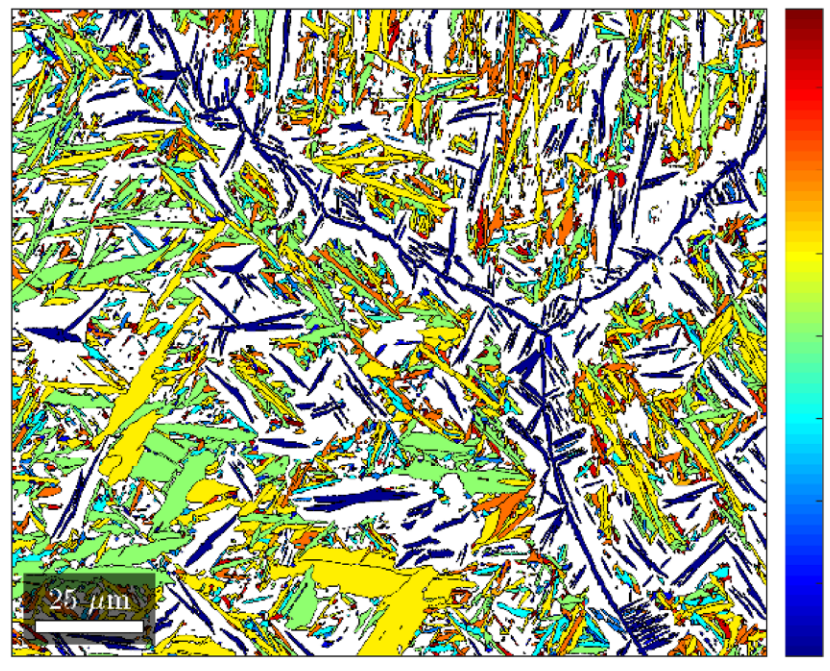

<b>MTEX</b> is a free Matlab toolbox for analyzing and modeling crystallographic textures by means of EBSD or pole figure data. It is developed on a free and opensource basis by an interdisciplinary

of material scientists, geologists and mathematicians.
 
<!---->
<!--  -->
&nbsp;
&nbsp;
&nbsp;
&nbsp;
&nbsp;
&nbsp;

<!-- news and community card -->

    

        

            

                <i class="fa fa-newspaper-o"></i>
                News
                <i class="fa fa-angle-double-right"></i>
                
            

            

                <ul class="no_bullet">
					<li>
						3/25 &minus;
						:
                    </li>
   					<li>
                        04/24 &minus;
							
                        released:
                        
                    </li>
				    <li>
                        03/24 &minus;
							
                        released:
                        
                    </li>
					<li>
						3/24 &minus;
						:
                        
                    </li>
                    <li>
                        9/22 &minus; newly designed homepage
                    </li>
                    <li>
                        3/22 &minus; addon 
                        
                        for parent grain reconstruction
                    </li>
                    <li>
                        3/22 &minus;
                        
                        by 
                        
                    </li>
                    <li>
                        7/21 &minus;
                        
                        by J. Hiscocks
                    </li>
                 </ul>
            

        

    

    

        

            

                <i class="fa fa-comments-o"></i>
                Community
            

            

                <ul>
                    <li>
                        
                        - Questions, Discussions, Announcements.
                    </li>
                    <li>
                        
                        - Every bug report is welcome.
                    </li>
                    <li>
                        {% include reference.html
                    link="https://gist.github.com/search?q=%23mtexScript&s=updated&o=desc"
						content="Helper functions" %}
                        - 
                    </li>
                    <li>
                        
                        - MTEX is open source and adding new features is more simple then you might think.
                    </li>
					<li>
                        
                        - lectures and exercises on the usage of MTEX.
                    </li>
					<!--
                    <li>
                        
                            GitHub Repository
                            <i class="fa fa-github"></i>
                        
                        
                        and
                        
                            ResearchGate Project
                            
                        
                        
                    </li>
                    <li>
                         explaining MTEX
                    </li>-->
                </ul>
            

        

    

<!-- a bunch of links as documentation overview  -->

    

        

            

                <i class="fa fa-book"></i>
                Documentation
                <i class="fa fa-angle-double-right"></i>
                
                | 
                | 
                | 
                | 
            

        

    

<!-- some featured examples with image and description -->

    

        

            

                
            

            

                <h4>Grain Tutorial</h4>
                
A quick guide through the grain reconstruction capabilities of MTEX.

                
            

        

    

    

        

            

                
            

            

                <h4>Denoising Orientation Maps</h4>
                
In this section we demonstrate how random errors can be significantly reduced using denoising techniques.

                
            

        

    

    

        

            

                
            

            

                <h4>Martensite Parent Grain Reconstruction</h4>
                
Here we demonstrate the tools MTEX offers to reconstruct a parent austenite phase from a measured martensite phase.

                
            

        

    

	

        

            

                
            

            

                <h4>Martensite Parent Grain Reconstruction</h4>
                
Here we demonstrate the tools MTEX offers to reconstruct a parent austenite phase from a measured martensite phase.

                
            

        

    

<!-- addons with image and description -->

    

        

            

                
            

            

                <h4>MTEX GUI</h4>
                
...
                    is a graphical user interface to MTEX that allows to perform many analysis step in a non programming way.
                

                

                    <i class="fa fa-user"></i>
                    
                

                

                    <i class="fa fa-home"></i>
                    
                

            

        

    

    

        

            

                
            

            

                <h4>MTEX2Gmsh</h4>
                
...
                    allows to generate meshes from EBSD data. It is intended to perform Finite Element Analysis (FEA) at grain scale on polycrystal imaged by EBSD.
                

                

                    <i class="fa fa-user"></i>
                    
                

                

                    <i class="fa fa-home"></i>
                    
                

            

        

    

    

        

            

                
            

            

                <h4>phaseSegmenter</h4>
                
...
                    enables the discrimination and segmentation of crystallographically identical/similar phases with grains of distinct orientation and slight compositional differences. The program uses reindexed EBSD datasets and EDS elemental data to compute grain-median compositional differences between grains of the phases in question and segments these by determination of an optimal threshold value.
                

                

                    <i class="fa fa-user"></i>
                    
                    , 
                

                

                    <i class="fa fa-home"></i>
                    
                

            

        

    

    <!-- proberly begin of second page -->
    

        

            

                
            

            

                <h4>Stabix</h4>
                

                    Slip transfer analysis toolbox
                

                

                    <i class="fa fa-user"></i>
                    
                

                

                    <i class="fa fa-home"></i>
                    
                

            

        

    

    

        

            

                
            

            

                <h4 title="orientation relationship tools">ORTools</h4>
                
...
                    is a function library for orientation relationship (OR) discovery, advanced <abbr title="orientation relationship">OR</abbr> analysis and the plotting of visually stunning and informative publication-ready figures particular to microstructures undergone partial or full orientation-related phase transformation. ORTools serves as an add-on to the phase transition functionalities in MTEX.
                

                

                    <i class="fa fa-user"></i>
                    
                    , 
                

                

                    <i class="fa fa-home"></i>
                    
                

            

        

    

    

        

            

                
            

            

                <h4>crystalAligner</h4>
                
...
                    is an experimental tool that allows to determine the alignment of one or two crystal directions or plane normals of arbitrary crystal orientation and structure with the coordinate system of a scanning electron microscope. The program outputs instructions for stage tilt and rotation for crystal alignment.
                

                

                    <i class="fa fa-user"></i>
                    
                

                

                    <i class="fa fa-home"></i>
                    
                

            

        

    

<!-- latest publications cards and requirements and licensing card-->

    

        

            

                <i class="fa fa-file-pdf-o"></i>
                Latest&nbsp;Publications
                <i class="fa fa-angle-double-right"></i>
                
            

            

                <ul>
					<li></li>
                    <li></li>
                    <li></li>
                    <li></li>
                    <li></li>
                </ul>
            

        

    

    

        

            

                <i class="fa fa-copyright"></i>
                Requirements and Licensing
            

            

                <ul>
                    <li>
                        MTEX is free and runs in standard Matlab. For GND and Taylor computation the optimization toolbox is required.
                    </li>
                    <li>
                        MTEX comes with binaries from the
                        
                        
                        which build up the core of MTEX.
                    </li>
                </ul>
            

        

    

