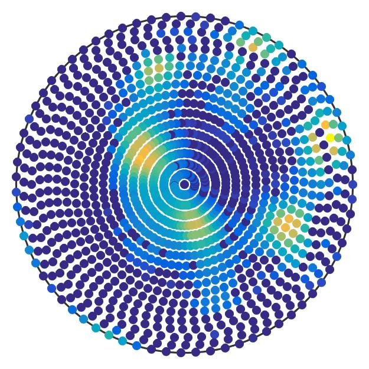
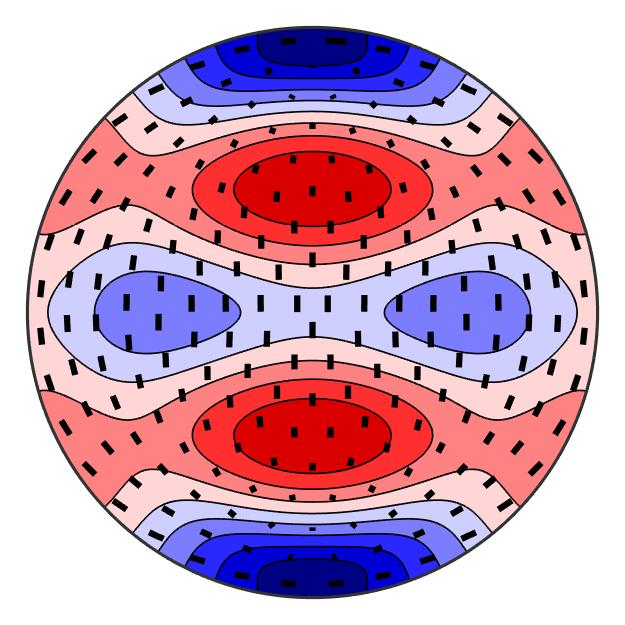

--- title: MTEX Toolbox keywords: homepage, home, news, featured examples last_updated: 30-Jun-2022 hide_sidebar: true permalink: index toc: false ---

    

        

            

                MTEX is a free Matlab toolbox for analyzing and modeling crystallographic textures by means of EBSD or pole figure data. It is developed on a free and opensource basis by an interdisciplinary <a href="people">team</a> of material scientists,
                geologists and mathematicians.
                 
                
                <!--  -->
            

        

    

    

        

            

                News
                <i class="fa fa-angle-double-right"></i>&nbsp;<a href="changelog">Complete changelog</a>
            

            

                <ul>
                    <li>MTEX 5.8.1 released: ・ <a href="https://github.com/mtex-toolbox/mtex/releases/download/mtex-5.8.1/mtex-5.8.1.zip" download><i class="fa fa-download"></i>&nbsp;Download</a> ・ <a href="changelog">Release Notes</a>                        ・ <a href="download">Installation</a></li>
                    <li>MTEX Online Workshop 2022: ・ <a href="https://github.com/mtex-toolbox/mtex/discussions/1314" target="_blank">Announcement</a> ・ <a href="workshop22?">Homepage</a></li>
                    <li>Manual <a href="https://www.researchgate.net/publication/353330126_Getting_Started_with_MTEX_for_EBSD_analysis_Rev6" target="_blank">Getting Started with MTEX for EBSD Analysis</a> by J. Hiscocks released</li>
                    <li>MTEX 5.7.0 released: ・ <a href="https://github.com/mtex-toolbox/mtex/releases/download/mtex-5.7.0/mtex-5.7.0.zip" download>Download</a> ・ <a href="changelog">Release Notes</a> ・ <a href="download">Installation</a></li>
                    <li>MTEX GUI 2.4 by J. Hiscocks released: ・ <a href="https://www.researchgate.net/profile/Jessica_Hiscocks/publication/341722714_MTEX_GUI_3pt4-_An_updated_graphical_interface_for_MTEX/data/5ed1b00e299bf1c67d274ede/MTEX-GUI-3pt4.zip" download>Download</a>                        ・ <a href="https://www.researchgate.net/publication/341722714_MTEX_GUI_3pt4-_An_updated_graphical_interface_for_MTEX" target="_blank">Announcment</a></li>
                </ul>
            

        

    

    

        

            

                Latest Publications
                <i class="fa fa-angle-double-right"></i>&nbsp;<a href="publications">All publication</a>
            

            

                <ul>
                    <li><a href="https://arxiv.org/pdf/2201.02103.pdf" target="_blank">The variant graph approach to improved parent grain reconstruction</a></li>
                    <li><a href="https://www-user.tu-chemnitz.de/~rahi/paper/parentGrain.pdf" target="_blank">Parent grain reconstruction from partially or fully transformed microstructures in MTEX</a></li>
                    <li><a href="https://www-user.tu-chemnitz.de/~rahi/paper/gazingAtCrystalBalls.pdf" target="_blank">Gazing at crystal balls - electron backscatter diffraction indexing and cross correlation on the sphere</a></li>
                    <li><a href="https://www-user.tu-chemnitz.de/~rahi/paper/denoising.pdf" target="_blank">Denoising of Crystal Orientation Maps</a></li>
                </ul>
            

        

    

    

        

            

                Featured Examples
                <i class="fa fa-angle-double-right"></i>&nbsp;<a href="function_reference">Function Reference</a>&nbsp;&amp;&nbsp;<a href="documentation">Documentation</a>
            

        

    

    

        

            

                
            

            

                <h4>Grain Boundaries</h4>
                
In this section we explain how to extract specific grain boundaries.

                <a href="BoundarySelect.html" class="btn btn-primary">Learn More</a>
            

        

    

    

        

            

                
            

            

                <h4>Pole Figures</h4>
                
By default MTEX plots pole figures by drawing a circle at every measurement position of a pole figure and coloring it corresponding to the measured intensity.

                <a href="PoleFigurePlot.html" class="btn btn-primary">Learn More</a>
            

        

    

    

        

            

                
            

            

                <h4>Tensor Averages</h4>
                
MTEX offers several ways to compute average material tensors from ODFs or EBSD data.

                <a href="TensorAverage.html" class="btn btn-primary">Learn More</a>
            

        

    

    

        

            
Community

            

                <ul>
                    <li><a href="https://github.com/mtex-toolbox/mtex/discussions" target="_blank">MTEX forum</a> - Questions, Discussions, Announcements.</li>
                    <li><a href="https://github.com/mtex-toolbox/mtex/issues" target="_blank">report issues</a> - Every bug report is welcome.</li>
                    <li><a href="https://gist.github.com/search?q=%23mtexScript&s=updated&o=desc" target="_blank">community scripts</a> - see how other MTEX users have utilized MTEX. Click <a href="scripts">here</a> to see how you can share your scripts.</li>
                    <li><a href="https://github.com/mtex-toolbox/mtex" target="_blank">contribute</a> - MTEX is open source and adding new features is more simple then you might think.</li>
                    <li><a href="https://www.researchgate.net/project/MTEX-free-crystallographic-texture-analysis-software" target="_blank">Researchgate Project</a></li>
                    <li><a href="videos">user videos</a> explaining MTEX</li>
                </ul>
            

        

    

    

        

            

                Addons
                <i class="fa fa-angle-double-right"></i>&nbsp;<a href="addons">MTEX Based Toolboxes</a>
            

            

                <ul>
                    <li>MTEX GUI</li>
                    <li>MTEX2Gmsh</li>
                    <li>Stabix</li>
                    <li>crystalAligner</li>
                    <li>ORTools</li>
                    <li>phaseSegmenter</li>
                </ul>
            

        

    

    

        

            
Requirements and Licensing

            

                <ul>
                    <li>MTEX is free and runs in standard Matlab. For GND and Taylor computation the optimization toolbox is required.</li>
                    <li>MTEX comes with binaries from the <a href="https://www-user.tu-chemnitz.de/~potts/nfft/" target="_blank"></a> which build up the core of MTEX.
                        <!-- Read[here]() for more details how fast Fourier transforms on the sphere and in the orientation space speed up texture computations. -->
                    </li>
                </ul>
            

        

    

